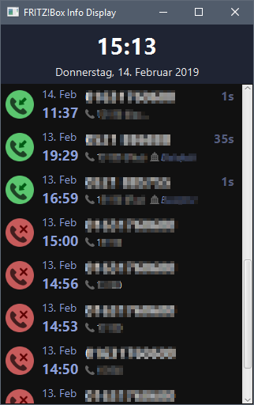
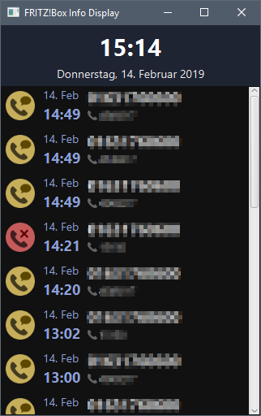
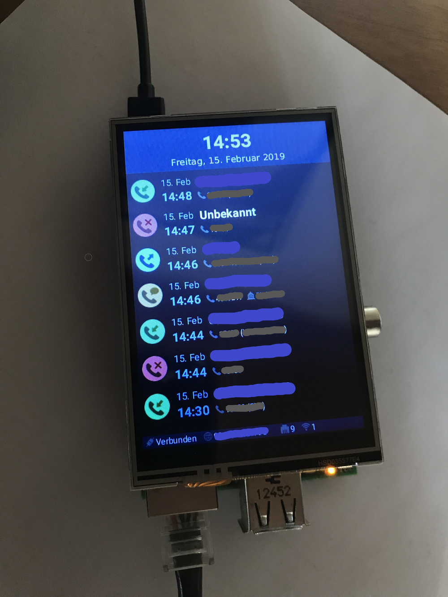

# FRITZ!Box Info Display

## Usage
``java -jar fritzbox_info_display-App.jar <Fritz!Box address> <username> <password> [live]``

## AVM TR-064

### Library
https://github.com/mirthas/FritzTR064

### Documentation
https://avm.de/service/schnittstellen/

### Features

#### Caller List
https://avm.de/fileadmin/user_upload/Global/Service/Schnittstellen/x_contactSCPD.pdf

#### WAN PPP (Connection info)
https://avm.de/fileadmin/user_upload/Global/Service/Schnittstellen/wanpppconnSCPD.pdf

#### Connected hosts
https://avm.de/fileadmin/user_upload/Global/Service/Schnittstellen/hostsSCPD.pdf

## City codes

### Database for Germany
https://www.bundesnetzagentur.de/SharedDocs/Downloads/DE/Sachgebiete/Telekommunikation/Unternehmen_Institutionen/Nummerierung/Rufnummern/ONRufnr/Vorwahlverzeichnis_ONBzip.html

## Screenshots

## Hardware

### Raspberry Pi
Raspberry Pi 3 B+: https://amzn.to/2Grxi8N

### Touchscreen
3.5" SPI Touchscreen: https://amzn.to/2Ebqkmi

Rotate the touch mapping:
https://github.com/goodtft/LCD-show/issues/49

### Prerequisites

#### Roboto Font
``sudo apt-get install font-roboto``

#### Java JDK 8 with JavaFX
Use this script: https://stackoverflow.com/questions/36961054/can-javafx-be-used-on-raspberry-pi

