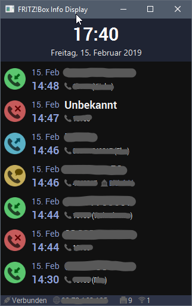

# FRITZ!Box Info Display

## AVM TR-064

### Library
https://github.com/mirthas/FritzTR064

### Documentation
https://avm.de/service/schnittstellen/

### Features

#### Caller List
https://avm.de/fileadmin/user_upload/Global/Service/Schnittstellen/x_contactSCPD.pdf

## City codes

### Database for Germany
https://www.bundesnetzagentur.de/SharedDocs/Downloads/DE/Sachgebiete/Telekommunikation/Unternehmen_Institutionen/Nummerierung/Rufnummern/ONRufnr/Vorwahlverzeichnis_ONBzip.html

## Screenshots

## Hardware

### Raspberry Pi
Raspberry Pi 3 B+: https://amzn.to/2Grxi8N

### Screen
3.5" SPI Screen: https://amzn.to/2Ebqkmi
